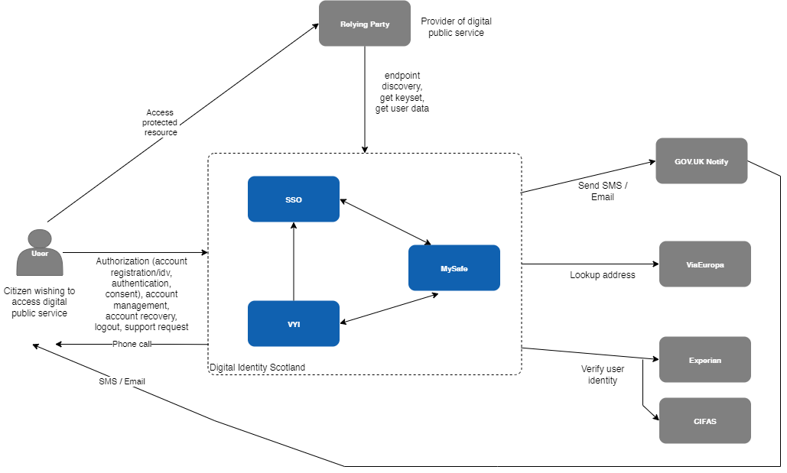
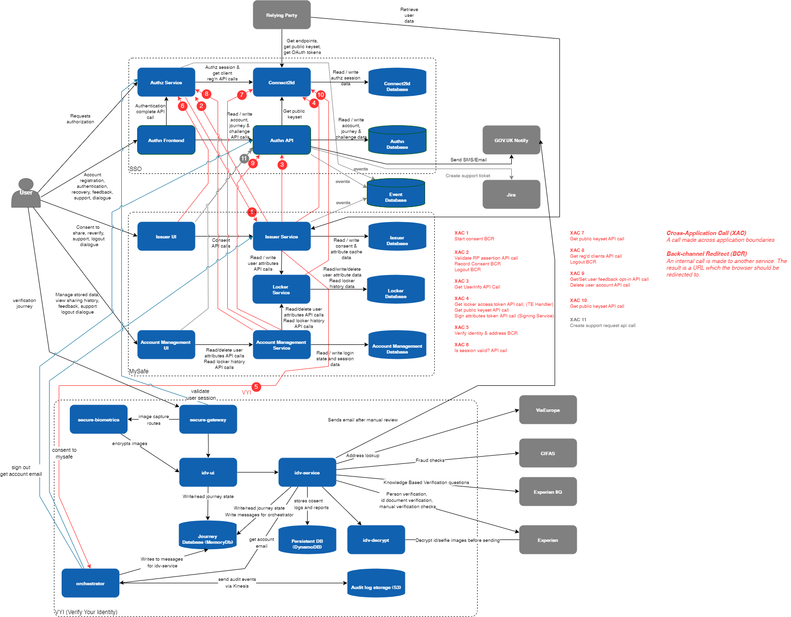
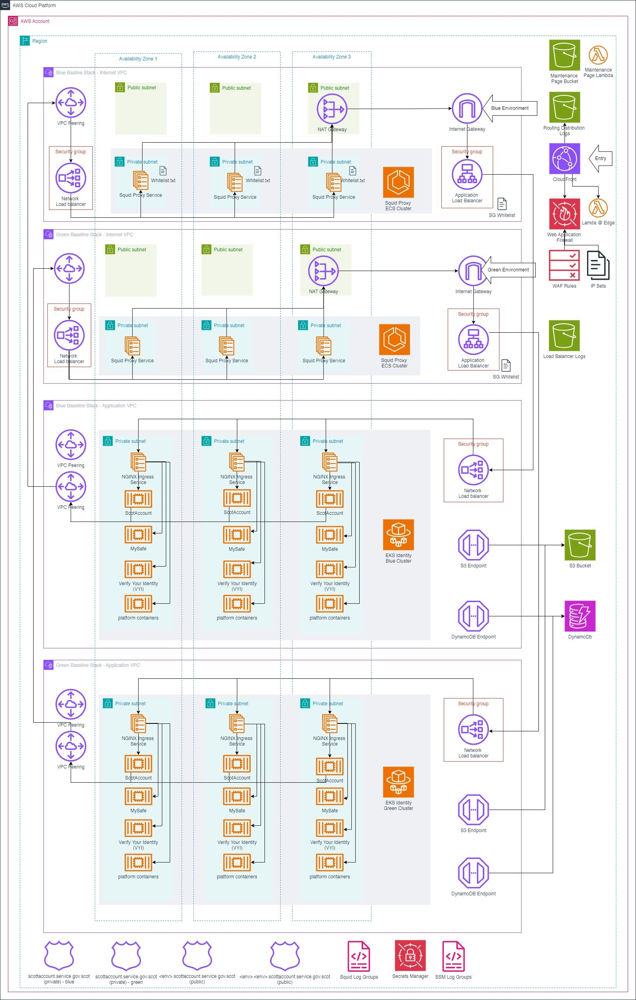

# Overview
Architectural documentation curating the designs of the constituent parts of the Digital Identity service. It currently provides 3 distinct services: Authentication and
Identity Verification and Issuer services. These are provided to Relying Parties using a
OIDC (Open ID Connect) auth code flow with PKCE. 

The table below summarises the key points on each flow.

<table>
<colgroup>
<col style="width: 18%" />
<col style="width: 11%" />
<col style="width: 14%" />
<col style="width: 55%" />
</colgroup>
<thead>
<tr class="header">
<th><strong>Capability Provided</strong></th>
<th><strong>Scope</strong></th>
<th><strong>GPG Standards</strong></th>
<th><strong>Description</strong></th>
</tr>
</thead>
<tbody>
<tr class="odd">
<td>Authentication</td>
<td>openid</td>
<td>gpg44 medium</td>
<td>
OIDC authorisation requests must contain the openid scope value
to indicate that an application intends to use the OIDC protocol.

The <em>ID token</em> obtained at the end of this flow has a
<em>Sub</em> field which is a UUID which unique and persistent
identifies a user. i..e every time the same user logs on an id token
with the same <em>Sub</em> will be produced.
</td>
</tr>
<tr class="even">
<td>Identity Verification</td>
<td>
openid

gpg-45-medium
</td>
<td>gpg45 medium</td>
<td>
Before an Identity verification flow can be run an authentication
flow MUST have been completed.

OIDC authorisation requests must contain the openid and the
gpg-45-medium scope values to indicate that an application intends to
use the OIDC protocol.
</td>
</tr>
</tbody>
</table>

## System Context View
This model describes the external environment in which the Digital
Identity Scotland system operates and identifies the parties which
interact with or are used by the system.

The Digital Identity Scotland service has a customer/supplier
relationship with each enrolled public sector body. The public sector
body is identified in this document as the **relying party**. Users
(i.e. citizens of Scotland) will continue to be identified as **user**.

## Container View

## Deployment Diagram

This diagram shows the key network topology and services used in the ScotAccount application.  It shows the correct network ingress and egress routes as well as illustrating the availability zone distribution of key components.  This diagram was based on the code in the repository as well as the information discovered using the AWS portal.

