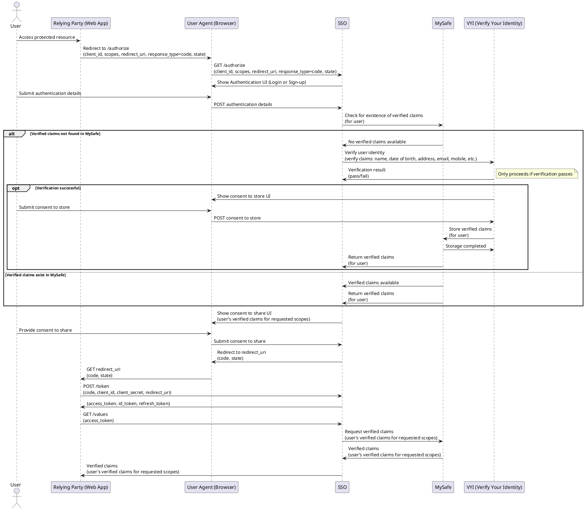

# Overview
Architectural documentation curating the designs of the constituent parts of the Digital Identity service. It currently provides 3 distinct services: Authentication and
Identity Verification and Issuer services. These are provided to Relying Parties using a
OIDC (Open ID Connect) auth code flow with PKCE. 

The table below summarises the key points on each flow.

<table>
<colgroup>
<col style="width: 18%" />
<col style="width: 11%" />
<col style="width: 14%" />
<col style="width: 55%" />
</colgroup>
<thead>
<tr class="header">
<th><strong>Capability Provided</strong></th>
<th><strong>Scope</strong></th>
<th><strong>GPG Standards</strong></th>
<th><strong>Description</strong></th>
</tr>
</thead>
<tbody>
<tr class="odd">
<td>Authentication</td>
<td>openid</td>
<td>gpg44 medium</td>
<td><p>OIDC authorisation requests must contain the openid scope value
to indicate that an application intends to use the OIDC protocol.</p>
<p>The <em>ID token</em> obtained at the end of this flow has a
<em>Sub</em> field which is a UUID which unique and persistent
identifies a user. i..e every time the same user logs on an id token
with the same <em>Sub</em> will be produced.</p></td>
</tr>
<tr class="even">
<td>Identity Verification</td>
<td><p>openid</p>
<p>gpg-45-medium</p></td>
<td>gpg45 medium</td>
<td><p>Before an Identity verification flow can be run an authentication
flow MUST have been completed.</p>
<p>OIDC authorisation requests must contain the openid and the
gpg-45-medium scope values to indicate that an application intends to
use the OIDC protocol.</p></td>
</tr>
</tbody>
</table>

## OIDC flow



This sequence diagram represents an **Enhanced OpenID Connect (OIDC) Flow with Identity Verification and Consent Management** includes an additional identity verification step, the storage of verified claims, and user consent to share specific claims with the Relying Party (RP). The enhanced flow empowers the user to control which verified claims (e.g., name, date of birth, email, etc.) are shared, ensuring greater transparency and control over their data. Below is a concise explanation of the key elements of the flow:

### 1. **Resource Access and Authorization Request**
- The **User** initiates access to a protected resource on the **Relying Party (Web App)**.
- The RP redirects the user to the **SSO** authorization endpoint with the OIDC parameters (`client_id`, `scopes`, `redirect_uri`, `response_type=code`, `state`).
- The **Browser** forwards the OIDC request to the **SSO** server.

### 2. **User Authentication**
- The **SSO** presents the user with an **Authentication UI** (e.g., login or sign-up).
- The **User** submits authentication details through the **Browser**, which are sent to the **SSO**.

### 3. **Verified Claims Discovery**
- The **SSO** checks for the existence of the user's verified claims in **MySafe**.
- Two possible scenarios follow:
  - **If verified claims exist** in MySafe:
    - **MySafe** returns the verified claims directly to the **SSO**.
  - **If verified claims are not found**:
    - The **SSO** initiates an **identity verification process** via **VYI (Verify Your Identity)**.

### 4. **Identity Verification and Consent to Store Claims**
- The **VYI** service verifies the user’s identity using their provided data (e.g., name, date of birth, address, email, mobile).
- Upon successful verification:
  - The **VYI** shows a **Consent to Store UI** to the user, allowing them to approve the storage of verified claims in **MySafe**.
  - The user submits their consent via the **Browser**.
  - After receiving consent, the **VYI** securely stores the user's verified claims in **MySafe**.
  - **MySafe** confirms the storage completion and notifies the **SSO** that the verified claims are now available.

### 5. **Consent to Share Claims**
- The **SSO** displays a **Consent to Share UI** to the user, listing the verified claims being requested by the RP.
- The user is given the choice to decide which verified claims (e.g., name, date of birth, email, etc.) are shared with the RP.
- The user submits their consent via the **Browser**, and the consent details are sent to the **SSO**.

### 6. **Token Exchange**
- Upon receiving the user's consent to share, the **SSO** redirects the user to the RP’s `redirect_uri` with an authorization `code` and state.
- The RP exchanges the authorization `code` for tokens by sending a POST request to the **SSO**'s token endpoint.
- The **SSO** returns an `access_token`, `id_token`, and `refresh_token` to the RP.

### 7. **Request for Verified Claims**
- The RP sends a request to the **SSO** to retrieve the user's verified claims using the `access_token`.
- The **SSO** forwards the request to **MySafe** to fetch the verified claims for the user's requested scopes.
- **MySafe** responds with the claims, which the **SSO** then delivers to the RP.

### 8. **Access to Protected Resource**
- The RP uses the verified claims received from the **SSO** to serve the user’s requested resource, maintaining a secure and seamless user experience.

### **Key Highlights of the Extended OIDC Flow**
- **Identity Verification Step**: If verified claims are not present, the flow incorporates an identity verification step via **VYI**. 
- **Consent to Store**: After successful verification, the user must consent before their claims are stored in **MySafe**.
- **Granular Claim Sharing**:
  - The user retains control over which verified claims are shared with the RP.
  - This ensures transparency and alignment with privacy principles.
- **Seamless Claim Management**: Secure interactions between the **SSO**, **MySafe**, and **VYI** ensure the integrity and availability of verified claims for the user's convenience.

This extended flow enhances the standard OIDC process by integrating identity verification, secure storage, and user-managed consent, ensuring robust security and user trust.


## System Context View

```puml
@startuml Digital Identity Scotland System Context

top to bottom direction
skinparam linetype curved

!include https://raw.githubusercontent.com/plantuml-stdlib/C4-PlantUML/master/C4_Container.puml

' Define user and RP above the DIS boundary
together {
  Person(user, "User", "Citizen wishing to access digital public services.")
  System_Ext(rp, "Relying Party", "Provider of digital public service.")
}

' Define the DIS boundary
together {
  System_Boundary(dis, "Digital Identity Scotland") {
      Container(sso, "SSO", "Java", "Single Sign-On component for authentication and authorization")
      Container(mysafe, "MySafe", "Java", "Secure vault for storing user identity data and claims")
      Container(vyi, "VYI", "Java", "Verifies your identity through external identity verification services")

      ' MySafe roles and responsibilities
      note left of mysafe
        MySafe manages and shares users' personal information (user attributes) securely:
        1. Issuer Service/UI - Displays locker data, manages consent, and handles attribute requests.
        2. Locker Service - Ensures secure storage of user-selected attributes.
        3. Account Management Service/UI - Allows users to manage stored attributes and view sharing history.
        Users are directed to MySafe after authentication if relying parties request access to attributes 
        using specific scopes.
      end note

      ' SSO roles and responsibilities
      note left of sso
        SSO manages both authentication (Authn) and authorization (Authz):
        1. **Authn Responsibilities:**
          - Guides users through journeys: Sign Up, Sign In, Recover/Reset Email, 
            Reset Password, and Reset Phone Number.
          - Provides UI and backend API to manage journey sessions and user account records, 
            deployed as separate pods in a Kubernetes cluster.
        2. **Authz Responsibilities:**
          - Manages client registrations (relying parties) and handles OIDC user flows.
          - Acts as a wrapper around Connect2Id to customize its behavior and proxy its APIs.
          - Determines user destinations when the `/authorize` API is called:
              - Authn for authentication,
              - MySafe for consent,
              - Relying Party with an authorization code,
              - Error page for failures.
          - Primarily interacts with external parties but has internal interactions with 
            Authn, MySafe, and VYI.
      end note

      ' VYI roles and responsibilities
      note left of vyi
        VYI (Verify Your Identity) orchestrates third-party services to verify 
        a user's claimed identity according to GPG 45 at a medium level of assurance.
        
        **Responsibilities:**
        - Interacts with external verification providers (e.g., document checks, biometrics, vouching).
        - Ensures consistency with GPG 45 guidelines by verifying identity evidence, 
          corroboration, and validation processes. GPG 45 is a UK government guideline for identity verification.
        - Medium level of assurance requires:
          - Sufficient identity evidence (e.g., photo ID and address proof).
          - Verification of the claimed evidence's validity and accuracy.
          - Corroboration across multiple checks to ensure identity linkage.
      end note
  }
}

' Define external systems below the DIS boundary
together {
  ' Updated Experian with Cross-Core Gateway and supporting services
  System_Ext(experian, "Experian Cross-Core Gateway", "Identity verification system delegating to multiple API services.")
  
  System_Ext(idauth, "ID Authenticate", "Validates identity and assesses confidence levels.")
  System_Ext(hunter, "Hunter", "Fraud detection service analyzing user behavior.")
  System_Ext(mitek, "Mitek", "Biometric verification service for facial recognition.")
  System_Ext(iiq, "Identity IQ", "Knowledge based verification. Challenge and response system.")

  ' ID Authenticate roles and responsibilities
  note bottom of idauth
    1. Validates name and address by searching trusted data sources.
    2. Checks for data inconsistencies indicating impersonation (e.g., mismatched DOB, deceased flags, credit activity).
    3. Assesses identity confidence based on number/quality of data proofs, duration, and type (e.g., mortgage vs credit card).
  end note

  ' Identity IQ roles and responsibilities
  note bottom of iiq
    1. Identity IQ performs challenge-response verification using trusted data.
    2. Asks randomly generated questions based on personal data only the legitimate user would know.
    3. Supports multiple clients and accounts with high configurability controlled by parameters.
  end note

  ' Hunter roles and responsibilities
  note bottom of hunter
    Hunter screens applications and customers to highlight potentially fraudulent activity. 
    1. It checks against previous applications or accounts for potential data manipulation and anomalies that could indicate fraud
    2. Previous applications that are known or suspected to be fraudulent, indicators of fraud risk
    3. Identifies applications from idividuals who are PEPs, subject to Sanctions, or with Adverse Media mentions that might indicate fraudulent activity.
  end note

  ' Mitek roles and responsibilities
  note bottom of mitek
    1. Verifies identity documents by analyzing security features.
    2. Performs facial comparison using a selfie and document photo to confirm ownership.
    3. Provides fraud indicators and checks against PEPs, sanctions, and media data.
  end note
}

together {
  System_Ext(cifas, "Cifas", "Fraud identification system.")
  System_Ext(via, "Via Europa", "Address lookup system.")
  System_Ext(vouchsafe, "Vouchsafe", "Identity checking system providing a vouching mechanism.")
  System_Ext(notify, "Gov.UK Notify", "Messaging system for SMS and email notifications.")

  ' Gov.UK Notify roles and responsibilities
  note top of notify
    Gov.UK Notify is used to send notifications to users via SMS and email. 
    1. Provides notification during account registration, recovery, and verification processes.
    2. Sends secure one-time passwords (OTP).
  end note

  ' Cifas roles and responsibilities
  note top of cifas
    Cifas is used to enhance identity verification by checking for indications of risk or misuse 
    associated with a claimed identity. 
    1. Operates on a reciprocal basis, providing access to attempted/actual fraud details from other members.
    2. Requires submission of identified fraud cases and retention of records for 3-6 years.
    3. Supports more robust IDV checks and mitigates risks from knowledge-based verification and vouching.
  end note

  ' ViaEuropa roles and responsibilities
  note top of via
    ViaEuropa is used for address lookup services.
    1. Validates and standardizes user-provided addresses against authoritative address datasets.
    2. Ensures accurate and consistent address data for identity verification processes.
    3. Supports services that require precise address validation to mitigate input errors or fraud.
  end note

  ' Vouchsafe roles and responsibilities
  note top of vouchsafe
    Vouchsafe is used for identity verification when users cannot provide documents 
    for biometric checks or fail the knowledge-based verification (KBV) process. 
    1. Allows verification using alternative evidence such as bank accounts, paper letters, 
      digital IDs, or trusted referees.
    2. Performs background checks to ensure the identity is genuine and not fraudulent.
    3. Enables access for individuals who find it difficult to prove their identity.
  end note
}

' Relationships
user --> dis: "Authorization (account registration/idv, authentication, consent), account management, account recovery, logout, support request"
user -l-> rp: "Access protected resource"
rp --> dis: "Endpoint discovery, get keyset, get user data"

' Connections to external systems
dis --> experian: "Verify user identity through gateway"
dis --> cifas: "Verify user fraud"
dis --> vouchsafe: "Verify user identity"
dis --> via: "Lookup address"
dis --> notify: "Trigger SMS/Email"
notify -u-> user: "Send SMS/Email"

' Expanded Experian Cross-Core Gateway delegation
experian --> idauth: "Perform identity verification"
experian --> hunter: "Analyze user behavior for fraud"
experian --> mitek: "Use biometric verification for identity"
experian --> iiq: "Knowledge-based verification"

' Internal relationships within DIS
sso --> vyi: "Handles identity verification process"
vyi <--> mysafe: "Stores and retrieves identity data securely"
sso <--> mysafe: "Access user claims and attributes for authentication"

@enduml
```

This system context diagram provides an overview of the **Digital Identity Scotland (DIS)** ecosystem, its internal components, and interactions with external systems. The system enables citizens to access digital public services securely by supporting registration, authentication, identity verification, and consent management. The key components and their functions are described below:

---

### 1. **Actors**
- **User**: A citizen seeking access to digital public services. They interact with the DIS system via the Relying Party (RP) and the Single Sign-On (SSO) component.
- **Relying Party (RP)**: A digital public service provider that integrates with the DIS system to enable secure authentication and authorization for its protected resources.

---

### 2. **Digital Identity Scotland (DIS) Boundary**
The DIS system is the core identity platform that manages user authentication, identity verification, and verified claims storage through three main components:
1. **SSO (Single Sign-On)**:  
    - Manages **authentication (Authn)** and **authorization (Authz)** for users and relying parties.
    - Handles user journeys like Sign Up, Sign In, Account Recovery, and Consent Management.
    - Interacts with internal systems such as MySafe and VYI, along with relying parties to manage OIDC flows and claims sharing.

2. **MySafe**:  
    - Acts as a secure vault for storing and managing user identity data and verified claims.
    - Comprises three major services: 
        1. **Issuer Service/UI**: Displays stored data, manages consent, and handles attribute requests.
        2. **Locker Service**: Ensures secure storage of user-selected attributes.
        3. **Account Management Service/UI**: Allows users to manage their attributes and sharing history.

3. **VYI (Verify Your Identity)**:  
    - Coordinates third-party services to verify user identity with a **medium level of assurance** in compliance with **GPG 45** (UK government identity verification standards).
    - Communicates with external services (e.g., document verification, biometrics, and fraud checks), validates evidence, and ensures corroboration across multiple checks.

---

### 3. **External Systems Interacting with DIS**
DIS interacts with several external systems to support identity verification, fraud detection, and communications:
1. **Experian Cross-Core Gateway**: Serves as the integration hub for multiple external verification mechanisms:
    - **ID Authenticate**: Validates name and address data, identifies inconsistencies, and calculates confidence levels.
    - **Hunter**: Screens for fraudulent activity by analyzing user behavior and comparing against existing records.
    - **Mitek**: Performs biometric checks and facial recognition using identity documents.
    - **Identity IQ**: Uses knowledge-based verification (KBV) for challenge-response authentication.

2. **Cifas**: Enhances fraud detection by checking for risks or misuse associated with a user's claimed identity using reciprocal fraud data sharing.

3. **Via Europa**: Provides address lookup and validation against authoritative datasets to ensure accurate and consistent address data.

4. **Vouchsafe**: Supports alternative identity verification methods (e.g., vouching or digital IDs) for users who cannot complete standard document- or knowledge-based checks.

5. **Gov.UK Notify**: Sends notifications (e.g., SMS, email) to users during key account events (registration, recovery, one-time-password delivery).

---

### 4. **Internal DIS Relationships**
- **SSO ↔ VYI**: The SSO hands off user data to VYI for identity verification, which then validates the identity through external systems before sending results back.
- **VYI ↔ MySafe**: Upon successful verification, VYI securely stores verified claims in MySafe.
- **SSO ↔ MySafe**: The SSO retrieves and manages user claims stored in MySafe for authentication, authorization, and consent management.

---

### 5. **Key Workflows**
1. **User Authorization**:
   - The user accesses a protected resource via the RP, which redirects authorization requests to DIS.
   - The DIS SSO handles authentication and authorization, ensuring secure access to requested resources.
   
2. **Identity Verification**:
   - If claims are unavailable in MySafe, the VYI processes identity verification requests by orchestrating checks through external systems (e.g., Experian, Mitek, Cifas).

3. **Consent Management**:
   - DIS ensures users have control over their data:
     - **Consent to Store**: Users approve storing verified claims in MySafe after successful identity verification.
     - **Consent to Share**: Users decide which verified claims to share with the relying party during the OIDC flow.

4. **Fraud Detection**:
   - External systems (e.g., Hunter, Cifas) help detect and prevent fraudulent activity through behavioral analysis, data corroboration, and shared fraud intelligence.

---

### 6. **Summary**
The Digital Identity Scotland system provides a centralized, secure, and user-focused platform for managing digital identity. By integrating powerful identity verification mechanisms, secure claim storage, and robust consent management, DIS ensures compliance with privacy and security standards while granting users granular control over their identity data. The architecture enhances trust and accessibility for public services.  


## Container View


## Deployment Diagram

This diagram shows the key network topology and services used in the ScotAccount application.  It shows the correct network ingress and egress routes as well as illustrating the availability zone distribution of key components.  This diagram was based on the code in the repository as well as the information discovered using the AWS portal.


