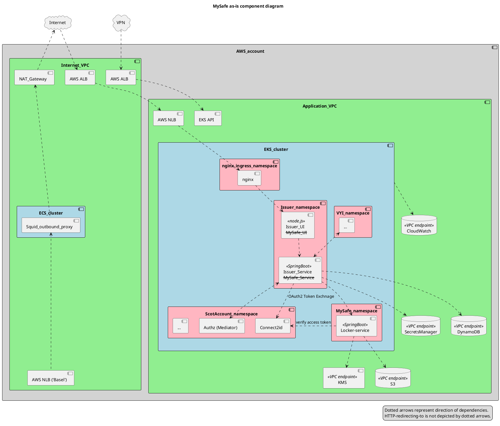
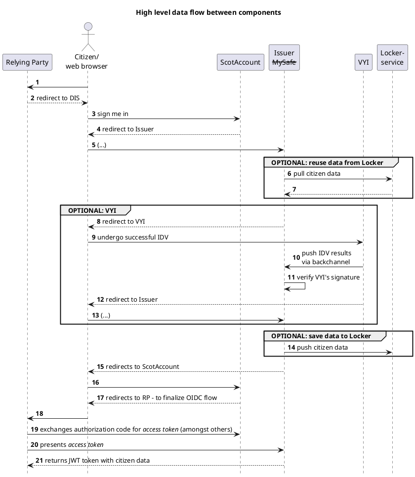
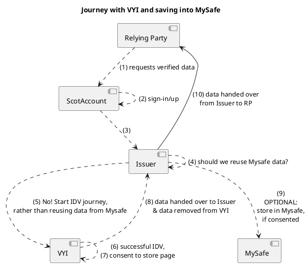
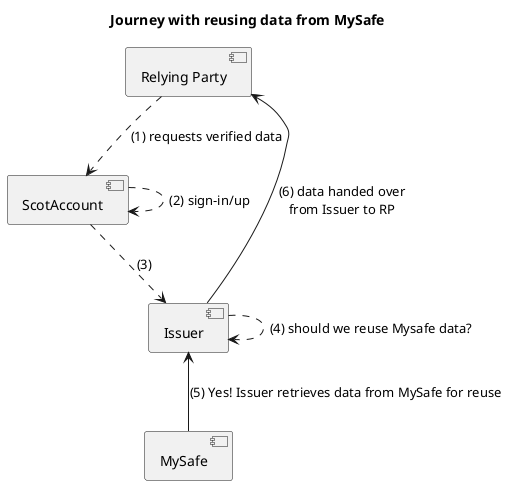
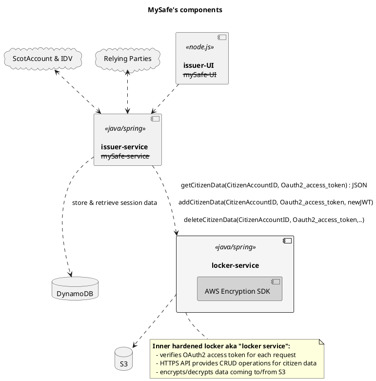

# MySafe Service

## Key concepts
- Key concept 1
- Key concept 2

## Component Diagram

## High level data flow diagram

## MySafe journey (Save)

## MySafe journey (Reuse)

## MySafe Service internal components
