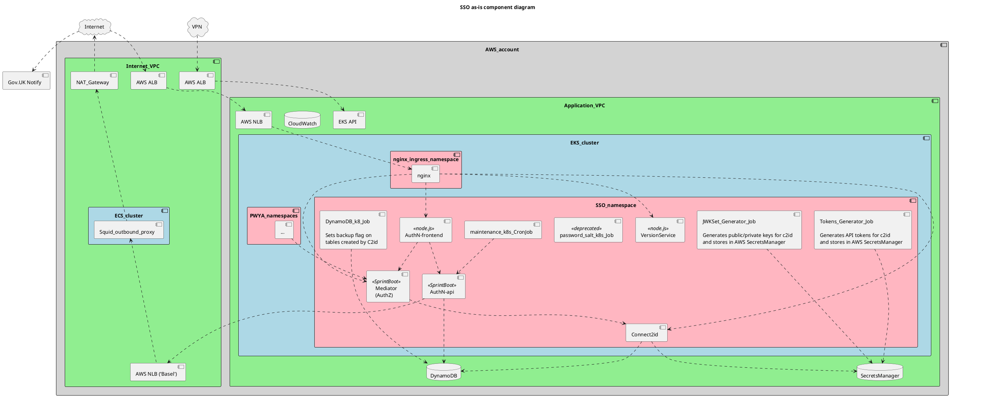

# ScotAccount Service

## Key concepts
- Key concept 1
- Key concept 2

## Component Diagram

```puml
@startuml
title SSO as-is component diagram
component AWS_account #LightGrey{
'    [AWS lambda for EKS API] as "AWS Lambda"
'    [AWS lambda for EKS API] ..> [EKS API]
    component Internet_VPC #LightGreen{
      [AWS ALB for App Ingress] as "AWS ALB"
      [AWS NLB for Squid] as "AWS NLB ('Basel')"
      component ECS_cluster #LightBlue{
         [Squid_outbound_proxy]
      }
      [AWS NLB for Squid] ..up..> Squid_outbound_proxy
      [AWS ALB for EKS] as "AWS ALB"
'      [AWS ALB for EKS] ..> [AWS lambda for EKS API]
      [NAT_Gateway]
    }
    component Application_VPC #LightGreen{
      [EKS API]
      database SecretsManager
      database CloudWatch
      [AWS NLB for App Ingress] as "AWS NLB"
      database DynamoDB
      component EKS_cluster #LightBlue{
          component PWYA_namespaces #LightPink{
                component pwya_services  as "..."{
                   }
        }
        component SSO_namespace #LightPink{
         [AuthN-api] <<SprintBoot>>
         [AuthN-frontend] <<node.js>>
         [Mediator] as "Mediator\n(AuthZ)" <<SprintBoot>>
         [Connect2id]
         [VersionService]<<node.js>>
         [maintenance_k8s_CronJob]
         [password_salt_k8s_Job] <<deprecated>>
         [DynamoDB_k8_Job] as "DynamoDB_k8_Job\n\nSets backup flag on\ntables created by C2id"
         [JWKSet_Generator_Job] as "JWKSet_Generator_Job\n\nGenerates public/private keys for c2id\nand stores in AWS SecretsManager"
         [Tokens_Generator_Job] as "Tokens_Generator_Job\n\nGenerates API tokens for c2id\nand stores in AWS SecretsManager"
        }
        component nginx_ingress_namespace #LightPink{
              [nginx]
        }
      }
    }
}
cloud Internet
cloud VPN
Internet ..>[AWS ALB for App Ingress]
VPN ..>[AWS ALB for EKS]
[AWS ALB for EKS]  ..> [EKS API]
[AWS ALB for App Ingress]..>[AWS NLB for App Ingress]
[AWS NLB for App Ingress]..>[nginx]
[Squid_outbound_proxy] ..up..> [NAT_Gateway]
[NAT_Gateway] ..> Internet
nginx ..> [AuthN-frontend]
nginx ..> [VersionService]
nginx ..> [Connect2id]
nginx ..> Mediator
[AuthN-frontend] ..> [AuthN-api]
[AuthN-frontend] ..> Mediator
Mediator ..> [Connect2id]
pwya_services ..> Mediator
maintenance_k8s_CronJob ..> [AuthN-api]
[AuthN-api]..> DynamoDB
[Connect2id] ..> DynamoDB
DynamoDB_k8_Job  ..> DynamoDB
JWKSet_Generator_Job ..> SecretsManager
Tokens_Generator_Job ..> SecretsManager
[Connect2id] ..> SecretsManager
[AuthN-api]..> [AWS NLB for Squid]
Internet ..> [Gov.UK Notify]
@enduml
```